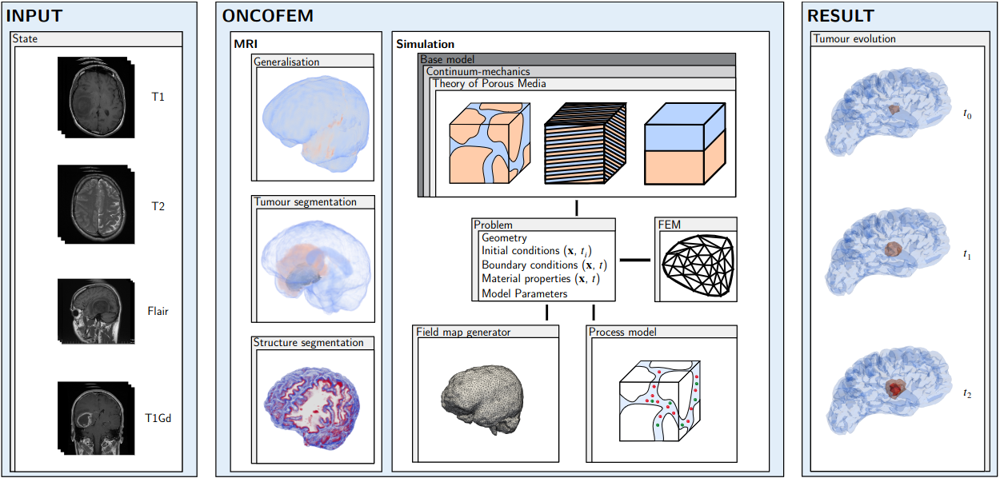

# OncoFEM
[](https://www.repostatus.org/#active) 


OncoFEM is a software tool to perform numerical simulations of tumours based on medical image data, providing a possible 
tumour evolution. The software is written to speed up the development towards an increasing demand for patient-specific 
simulations, with the ultimate goal of supporting clinicians in their treatment planning, i.e. medication, surgical 
interventions, or classifying the severeness. The structure and workflow of OncoFEM is kept general, to be open for the 
inclusion of different types of tumours, organs or tissues. Nevertheless, its initial implementation is written for the 
simulation of diffusive astrocytomas (brain tumour), such as Glioblastoma multiforme (GBM). The software divides into 
the preprocessing of medical images in separated repositories and this simulation core module.

Numerical calculations can be performed by a combination of a base model that set the general framework of regarded 
entities, together with process models that mimic the representative behaviour. For demonstration, the implementation of 
a two-phase model in the continuum-mechanical framework of the Theory of Porous Media is chosen, with respect to the 
tumour microenvironment based on Wolf et al.<sup>1</sup>. In OncoFEM, the problem is modelled with a porous approach of 
a solid extracellular matrix and an intercranical fluid, wherein mobile cancer cells are resolved and measured with a 
molar concentration. The processes on the microscale are assumed with a logistic Verhulst equation for the mobile cancer 
cells that can be coupled to the solid via growth terms. In case of growing tumour mass fluid will be accumulated in the 
affected areas and a swelling can be observed. The defined set of governing equations is then solved with the finite 
element method using the software package FEniCS<sup>2</sup>.

* [Integration of OncoFEM](#integration)
* [Software availability](#software)
* [Installation and machine requirements](#installation)
* [Tutorial](#tutorial)
* [How to](#howto)
    * [Implement a base model](#basemodel)
    * [Implement a process model](#processmodel)
* [Known bugs](#bugs)
* [Planned development](#development)
* [How to cite](#howtocite)
* [Literature](#literature)

## <a id="integration"></a> Integration of OncoFEM

OncoFEM is the core package of a module based umbrella software project for numerical simulations of patient-specific 
cancer diseases, see following figure. From given input states of medical images the disease is modelled and its evolution 
is simulated giving possible predictions. In this way, a digital cancer patient is created, which could be used as a basis 
for further research, as a decision-making tool for doctors in diagnosis and treatment and as an additional illustrative 
demonstrator for enabling patients understand their individual disease. All parts resolve to an open-access framework, 
that is ment to be an accelerator for the digital cancer patient. Each module can be installed and run independently. The 
current state of development comprises the following modules

- OncoFEM (https://github.com/masud-src/OncoFEM)
- OncoGEN (https://github.com/masud-src/OncoGEN)
- OncoTUM (https://github.com/masud-src/OncoTUM)
- OncoSTR (https://github.com/masud-src/OncoSTR)
<p align="center">
 
</p>

## <a id="software"></a> Software availability

You can either follow the installation instruction below or use the already pre-installed virtual boxes via the 
following Links:

- Version 0.1.0:  https://doi.org/10.18419/darus-3720

## <a id="installation"></a> Installation and Machine Requirements

This installation was tested on a virtual box created with a linux mint 21.2 cinnamon, 64 bit system and 8 GB RAM on a 
local machine (intel cpu i7-9700k with 3.6 GHz, 128 GB RAM). To ensure, the system is ready, it is first updated, 
upgraded and basic packages are installed via apt.
````bash
sudo apt update
sudo apt upgrade
sudo apt install build-essential python3-pytest gmsh libz-dev cmake libeigen3-dev libgmp-dev libgmp3-dev libmpfr-dev libboost-all-dev python3-pip git
````
- Anaconda needs to be installed. Go to https://anaconda.org/ and follow the installation instructions. On Linux you
  can use the following command. Herafter, restart the terminal.
```bash
wget -O Anaconda.sh https://repo.anaconda.com/archive/Anaconda3-latest-Linux-x86_64.sh
bash Anaconda.sh -b -p $HOME/anaconda3
eval "$($HOME/anaconda3/bin/conda shell.bash hook)"
conda init
```
- Run the following command to set up an anaconda environment for OncoFEM and installation on the local system.
````bash
git clone https://github.com/masud-src/OncoFEM/
cd OncoFEM
conda env create -f oncofem.yaml
conda activate oncofem
python3 -m pip install .
````
- Set the global path variable and config file. For Linux and macOS modify run the following lines. In Windows system 
the script will create a batch file ('set_config.bat') in your home directory. Run this file from the Command Prompt. 
Actualise your system and activate oncofem again. If necessary, change the directories in the config.ini file.
````bash
chmod +x set_config.sh.
./set_config.sh
````
- In order to handle real image data and transform this to readable files, the software package SVMTK package need to be 
installed by the following code lines or visit https://github.com/SVMTK/SVMTK for comprehensive instructions. This is 
only necessary for tutorial 3 and 4. You can use the software without this extension, see tutorial 1 and 2.
````bash
cd ..
git clone --recursive https://github.com/SVMTK/SVMTK
cd SVMTK
python3 -m pip install .
cd ..
````
- For quick evaluation of the software is correctly installed, please open python in a terminal and run
````bash
import oncofem
````
## <a id="tutorial"></a> Tutorial

There is a tutorial for the umbrella software project provided on DaRUS 
(https://darus.uni-stuttgart.de/dataset.xhtml?persistentId=doi:10.18419/darus-4639). You can download and run the
tutorial_structure_segmentation.py file by run the following lines in your desired directory.
````bash
curl --output tutorial https:/darus.uni-stuttgart.de/api/access/dataset/:persistentId/?persistentId=doi:10.18419/darus-4639
````
The tutorial can be started with
````bash
conda activate oncofem
python oncofem_tut_01_quick_start.py
````
## <a id="howto"></a> How to

You can modify the existing algorithms, respectively expand the existing by your own. Therefore, you can fork and ask 
for pull requests.

### <a id="basemodel"></a> Implement a base model

The base model implements the macroscopic entities of the tumor within its environment. Every custom implemented base 
model shall inherit functionalities from the super class 'base_model'. This general scheme ensures the functionalities 
to interfacing objects. In the following, the implementation of a custom model in the framework of multiphasic 
continua shall be sketched. 

A new base model class begins by inheriting the super class. The call for the super object is also needed in the init 
function. Herein, all parameters and internal object should be hold via instance variables.
````python
class NewModel(BaseModel):
    """
    introductory text, that explains basic information about the model approach. This is followed by a list of
    implemented methods and a short description of them.

    *Methods:*
        set_boundaries:         Sets surface boundaries, e. g. Dirichlet and Neumann boundaries.
        assign_if_function:     Helper function, that assigns values to the solution field and old solution field, if a
                                function is given. Used for adaptive initial conditions.
        actualize_prod_terms:   Actualises production terms in each time step.
    """
    def __init__(self):
        super().__init__()
        # general info
        self.output_file = None
        self.flag_defSplit = False
        ...
````
Next, a simple setter function is implemented to assign the boundary conditions. This is written in a 
continuum-mechanical style with Dirichlet and Neumann conditions and can be changed to anything.
```python
def set_boundaries(self, d_bound, n_bound) -> None:
    self.d_bound = d_bound
    self.n_bound = n_bound   
```
The next function is a not inherited one. With 'assign_if_function', it is evaluated, if the initial conditions that are
given, are spatially varying and then assigned into the actual solution vectors. In general, it is also possible to
simply define scalar values for particular quantities. Therefore, the user is also free to implement simple functions
inside the module for specific tasks.
```python
def assign_if_function(self, var, index) -> None:
    if type(var) is df.Function:
        df.assign(self.sol.sub(index), var)
        df.assign(self.sol_old.sub(index), var)
```
In terms of the definition of initial boundary problem, next the initial conditions need to be set. In the 
implementation of the 'two_phase_model', a case distinction is done, that allows end users to set initial primary
variables with scalar values, distributions from MeshFunctions load via xdmf files or Function definitions. Herein, it 
is split into init variables and add variables, which enable the implementation of multiple components, that are 
resolved in the fluid.
```python
def set_initial_conditions(self, init, add) -> None:
    self.uS_0S = init.uS_0S
    self.p_0S = init.p_0S
    self.nS_0S = init.nS_0S
    if hasattr(add, "prim_vars"):
        self.cFkappa_0S = add.cFkappa_0S
```
The code of the 'two_phase_model' is followed by setter functions for the instance variables. First, the function spaces
are spanned. This necessary step initializes the primary variables and modification of them become possible. Therefore,
they can be set to initial values, it is possible to extract them for evaluation or they can be given to the micro 
modelling interface. In 'set_param', generally all parameters are set by giving a pre-defined problem object and with 
'set_micro_models' the interface to the bio-chemical set up is connected. 
```python
def set_function_spaces(self) -> None:
    """
    Sets function space for primary variables u, p, nS, cFdelta and for internal variables
    """
    ...
    
def set_param(self, ip:Problem) -> None:
    # general parameters
    ...
    # time parameters
    ...
    # material parameters base model
    ...
    # spatial varying material parameters
    ...
    # FEM paramereters and additionals
    ...
    # geometry parameters
    ...

def set_process_models(self, prod_terms:list) -> None:
    ...
```
In 'output' the writing of output quantities is ment. Here it is defined which quantities are written in every time 
step. To do so in the helper sub-package a function 'write_field2xdmf' is implemented.
```python
def output(self, time_step:float) -> None:
    for idx, prim_var in enumerate(self.prim_vars_list):
        write_field2xdmf(self.output_file, self.sol.sub(idx), prim_var, time_step)
```
Two internal functions are 'unpack_prim_pvars' and 'set_hets_if_needed', both are convenient functions, that realise a
flexible usage of the module 'two_phase_model'. The first is writte to unpack an arbitrary number of primary variables,
the second either set heterogeneous material parameters by interpolation over the whole domain or assigns them via 
spatially constant values. The second function is called from the setter function for structural parameters.
```python
def unpack_prim_pvars(self, function_space:df.FunctionSpace) -> tuple:
    """unpacks primary variables and returns tuple"""
    u = df.split(function_space)
    p = []
    for i in range(self.n_init_prim_vars, len(u)):
        p.append(u[i])
    return u[0], u[1], u[2], p 

def set_hets_if_needed(self, field) -> Union[df.Constant, df.Function]:
    if type(field) is float:
        field = df.Constant(field)
    else:
        help_func = field
        field = df.Function(df.FunctionSpace(self.mesh, "DG", 0))
        field.interpolate(help_func)
    return field
    
def set_structural_parameters(self) -> None:
    self.kF = self.set_hets_if_needed(self.kF)
    self.lambdaS = self.set_hets_if_needed(self.lambdaS)
    self.muS = self.set_hets_if_needed(self.muS)
    for i in range(len(self.DFkappa)):
        self.DFkappa[i] = self.set_hets_if_needed(self.DFkappa[i])
```
The core method of a continuum-mechanical base model that is solved with the finite element method is the 'set_weak_form'
method. Herein, the actual weak forms are set and the problem is translated into a solver scheme for the single newton
interation time step with 'set_solver'
```python
def set_weak_form(self) -> None:
    # Get Ansatz and test functions
    ...
    # Calculate volume fractions
    ...
    # Get growth terms
    ...
    # Kinematics with Rodriguez Split
    ...
    # Calculate velocities
    ...
    # Calculate Stress
    ...
    # Define weak forms
    ...
    # Momentum balance of overall aggregate
    ...
    # Volume balance of the mixture
    ...
    # Volume balance of solid body
    ...
    # Concentration balance of additionals
    ...
    # Sum up to total residual
    ...
    
def set_solver(self) -> None:
    prm = df.parameters["form_compiler"]
    prm["quadrature_degree"] = 2  # Make sure quadrature_degree stays at 2
    self.sol = self.ansatz_functions
    solver = aux.Solver()
    solver.solver_type = self.solver_param.solver_type
    solver.abs = self.solver_param.abs
    solver.rel = self.solver_param.rel
    solver.maxIter = self.solver_param.maxIter
    self.solver = solver.set_non_lin_solver(self.residuum, self.sol, self.d_bound)
```
Finally the incremental-iterative solver scheme is set up by the 'solve' method. Herein, first a loop over time steps is
initialized and the initial time step is written. The actual solution will be solved and the communication method
'actualize_prod_terms()' are called to update them at each time step. Thereafter, the output is generated and the 
history fields are updated.
```python
def solve(self) -> None:
    # Initialize  and time loop
    t = 0.0
    out_count = 0.0
    time_flag = True
    self.output(t)
    print("Initial step is written")
    while t < self.T_end:
        # Increment solution time
        t = t + self.dt
        self.time.assign(t)
        out_count += self.dt
        # Calculate current solution
        if time_flag:
            timer_start = time.time()
            time_flag = False
        n_iter, converged = self.solver.solve()
        # actualize prod terms
        self.actualize_prod_terms()
        # Output solution
        if out_count >= self.output_interval:
            timer_end = time.time()
            time_flag = True
            print("Time: {}".format(t), "  ", "Converged in steps: {}".format(n_iter), " ", 
                  "Calculation time: {:.2f}".format(timer_end - timer_start), 
                  "finish_meter: {:.2f}".format(t/self.T_end))
            out_count = 0.0
            self.output(t)
        # Update history fields
        if self.flag_defSplit:
            self.intGrowth_n.assign(df.project(self.intGrowth, self.CG1_sca))
        self.sol_old.assign(self.sol)
```

### <a id="processmodel"></a> Implement a process model

Analogous to the base model implementation, process models are implemented via a new defined class of the particular 
model that inherits from a super class. The main difference is that the user is absolutely free in implementation apart 
from a 'set_input' and 'get_output' method, that shall be preserved as interface for the base model.
```python
class ProcessModel:
    """
    The micro model base class defines necessary attributes and functions for the connection to the base model. To be 
    embedded in the OncoFEM structure, one has to create a bio-chemical model with a neccessary problem. In that way, 
    primary and secondary variables are accessible.

    *Methods:*
        set_vars:       interfacing method for input variables
        get_output:     interfacing method for output variables 
    """
    def __init__(self, *args, **kwargs):
        pass

    def set_input(self, *args, **kwargs):
        pass

    def get_output(self):
        pass
```
In order to apply this scheme now, for a simple Verhulst kinetic. Again, it is based from the super class and should
have some basic description at the beginning. Again, parameters are initialised and hold by the instance via definition
in the init function. Due to the simplicity of the model, only the primary variables need to be loaded via the setter
function. In the getter method, the actual function of the Verhulst equation is implemented and the particular 
production terms are set. It is possible to create interfaces to other modelling software via precice<sup>3</sup>
or to implement simple neural networks<sup>4</sup>.
````python
class VerhulstKinetic(ProcessModel):
    """
    Implements a simple Verhulst-like growth kinetic for mobile cancer cells resolved in a fluid constituent. A switch
    can turn on a coupling with the solid phase. According to the amount of cancer cell concentration, the solid body
    will growth until a max level is reached. 

    *Attributes*:
        prim_vars:          Herein, the primary variables are hold
        flag_solid:         Bool, sets coupling from cancer cell concentration to solid body
        max_cFt:            Float, sets maximum cancer cell concentration
        max_nS:             Float, sets maximum volume fraction of solid body
        speed_cFt:          Float, controls growth speed of cancer cell concentration
        speed_nS:           Float, controls growth speed of solid body

    *Methods*:
        set_prim_vars:      Sets primary variables given via ansatzfunctions from a mixed element
        get_micro_output:   Calculates the Verhulst-like growth kinetic and returns the production terms
    """
    def __init__(self):
        super().__init__()
        self.prim_vars = None
        self.flag_solid = False
        self.max_cFt = 9.828212e-1  # 10e12 * mol / m^3 
        self.min_nS = 0.75 / 2.0
        self.speed_cFt = 1.0e6  #5.8e6  # 10e6 * mol / (m^3 s)
        self.speed_nS = 1.0e-6

    def set_input(self, ansatz_functions: df.Function):
        self.prim_vars = df.split(ansatz_functions)

    def get_output(self):
        u, p, nS, cFt = self.prim_vars
        hat_cFt = cFt * df.Constant(self.speed_cFt) * (1.0 - cFt / df.Constant(self.max_cFt))

        if self.flag_solid:
            hat_nS = (cFt / self.max_cFt) * cFt * df.Constant(self.speed_nS) * (1.0 - nS / df.Constant(self.min_nS))
        else:
            hat_nS = df.Constant(0.0)

        prod_list = [None] * (len(self.prim_vars) - 2)
        prod_list[0] = hat_nS
        prod_list[1] = hat_cFt
        return prod_list
````

## <a id="bugs"></a> Known Bugs

- On some machines the simulation stops with the following error:
    ````bash
    Error:   Unable to solve linear system using PETSc Krylov solver.
    Reason:  Solution failed to converge in 0 iterations (PETSc reason DIVERGED_PC_FAILED, residual norm ||r|| = 0.000000e+00).
    ````
    The problem is, that the newton solver fails, because it somehow already converged. A workaround is to change the 
    used solver type to "lu" or "gmres". It seems to be a memory issue with this large systems.

## <a id="development"></a> Planned development

- Appending about a high-fidelity model for glioblastomas
- Appending about a non continuum-mechanical model for generalised tumours
- Improve interpolation of field map generator for faster application
- Bug fixing

## <a id="howtocite"></a> How to cite

TBD

## <a id="literature"></a> Literature

<sup>1</sup>  Kayla J. Wolf et al., Dissecting and rebuilding the glioblastoma microenvironment with engineered materials, Nature Reviews Materials, Springer Science and Business Media LLC, 2019, https://www.ncbi.nlm.nih.gov/pmc/articles/PMC7347297/

<sup>2</sup> Anders Logg et al., Automated Solution of Differential Equations by the Finite Element Method, Springer Berlin Heidelberg, 2012, DOI: 10.1007/978-3-642-23099-8

<sup>3</sup> Benjamin Rodenberg et al., FEniCS-preCICE: Coupling FEniCS to other Simulation Software, arXiv, 2021, DOI: 10.48550/ARXIV.2103.11191

<sup>4</sup> Sebastian K. Mitusch et al., Hybrid FEM-NN models: Combining artificial neural networks with the finite element method, Journal of Computational Physics, Elsevier, DOI: 10.1016/j.jcp.2021.110651
